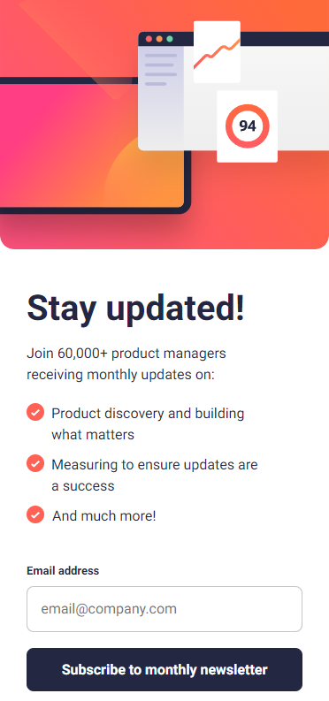
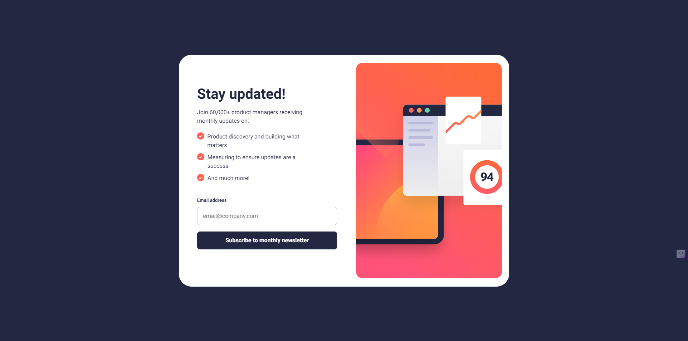

# Frontend Mentor - Newsletter form solution

This is a solution to the [Newsletter sign-up form challenge on Frontend Mentor](https://www.frontendmentor.io/challenges/newsletter-signup-form-with-success-message-3FC1AZbNrv/hub).

### Screenshot

**Mobile version of the final product**

**Desktop version of the final product**

## My process

### Built with

-   Figma design files
-   Semantic HTML5 markup
-   SCSS custom properties
-   ValidatorJS Library
-   Flexbox
-   Mobile-first workflow

## Author

-   Website - [GitHub](https://github.com/joshhovis)
-   LinkedIn - [LinkedIn](https://www.linkedin.com/in/joshua-hovis/)
-   Frontend Mentor - [@joshhovis](https://www.frontendmentor.io/profile/joshhovis)
